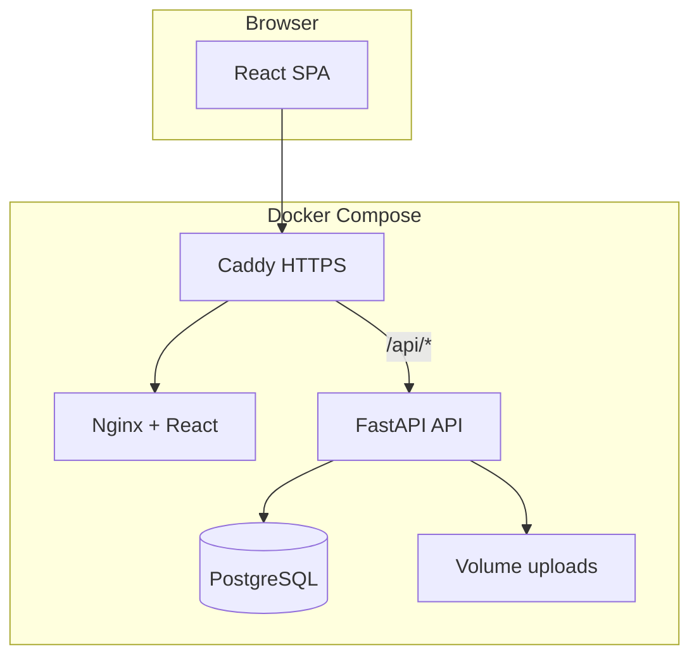
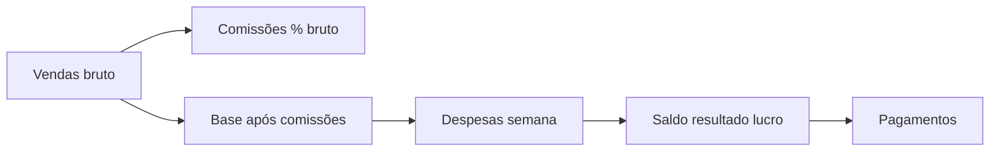
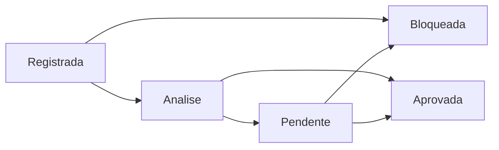

# Plano de Desenvolvimento — Arpadesk

## Contexto e premissas

- Repositório [`c:\xampp\htdocs\arpadesk`](c:\xampp\htdocs\arpadesk) está **vazio** (só `.git`). Tudo será construído do zero.
- **Projeto atual**: controle semanal no Google Sheets, exportado em PDF e depois limpo — **não há banco legado**. Migração = cadastro manual do histórico recente (opcional) + operação 100% no Arpadesk daqui em diante.
- **Usuários com login**: você (admin) cria quem entra no sistema — ex.: **financeiro** e **líder (C2)**. Demais pessoas (**gerentes**, colaboradores) são cadastradas como **participantes do projeto** sem acesso ao Arpadesk; servem só para base de cálculo e gestão interna do financeiro.
- **Suporte**: **somente você (admin)** acessa o módulo. Compartilhar credencial = botão **Copiar** no campo (clipboard), sem dar login a terceiros.
- **UI**: design **minimalista e objetivo**, **desktop-first** (layout otimizado para telas largas; responsivo secundário no MVP).
- Referência de stack na mesma org: [`valida-bacen`](c:\xampp\htdocs\valida-bacen) (React + FastAPI + JWT + Docker + Caddy). Reutilizar padrões de auth e deploy, **trocando MongoDB por PostgreSQL** no financeiro.

---

## Decisão: PostgreSQL (recomendado) vs MongoDB

| Critério | PostgreSQL | MongoDB |
|----------|------------|---------|
| Dinheiro (DECIMAL, arredondamento) | Nativo, preciso | Exige cuidado extra |
| Relatórios (saldo semanal, comissões por participante) | SQL + agregações maduras | Possível, mais frágil |
| Integridade (venda �?' comissões �?' pagamento) | FK + transações ACID | Sem FK nativo |
| Auditoria financeira | Triggers, constraints | Manual |
| Cofre de credenciais (JSON flexível) | JSONB funciona bem | Natural, mas não compensa |
| Escala MVP pequena | Excelente | Excelente |

**Recomendação: PostgreSQL 16** no Docker. O domínio financeiro é relacional por natureza; JSONB cobre campos flexíveis de ativos (emulador, API keys, metadados). MongoDB faria sentido se o produto fosse só documentos flexíveis — não é o caso.

---

## Arquitetura proposta



**Stack**

| Camada | Tecnologia |
|--------|------------|
| Frontend | React 18, Tailwind, shadcn/ui — **desktop-first**, paleta neutra, poucos componentes por tela |
| Backend | FastAPI, SQLAlchemy 2 + Alembic, Pydantic v2 |
| Auth | JWT + bcrypt; roles: `admin`, `financeiro`, `lider` |
| Banco | PostgreSQL 16 |
| Arquivos | Volume Docker (`/data/uploads`) — comprovantes PDF/imagem |
| Segredos ativos | AES-256-GCM via `cryptography`; chave mestra em `VAULT_MASTER_KEY` (env) |
| Deploy | Docker Compose + Caddy (espelhar [`valida-bacen/docs/09-deploy-docker-vps.md`](c:\xampp\htdocs\valida-bacen\docs\09-deploy-docker-vps.md)) |

---

## Modelo de domínio — Financeiro (orientado a projetos)

### Fluxo de negócio (regra do projeto atual)



**Regra central**: comissões calculadas sobre o **valor bruto** de cada venda. Despesas da semana são lançadas separadamente. O **saldo (resultado)** = receitas líquidas após comissões �^' despesas do período. Pagamentos registram o que foi efetivamente pago aos participantes.

### Entidades principais

**Projeto** (`projects`)
- nome, status (`ativo` / `arquivado`), período de fechamento (`semanal` no MVP)
- moeda padrão (BRL)

**Usuário do sistema** (`users`) — quem faz login
- email, senha, role: `admin` | `financeiro` | `lider`
- criado pelo admin; opcionalmente vinculado a um `project_participant` (ex.: líder C2)

**Participante do projeto** (`project_participants`) — entidade de negócio, **sem login obrigatório**
- `user_id` nullable — preenchido só se a pessoa também tem acesso ao sistema
- nome, papel: `gerente`, `lider`, `colaborador`, `socio`, etc.
- `remuneration_type`: `comissao_percentual` | `fixo` | `clt`
- `commission_rate` (% sobre bruto), `fixed_amount` (se fixo)
- **Gerentes**: cadastro normal de participante, `user_id = null` — entram no cálculo de comissões, não logam no Arpadesk

**Venda** (`sales`)
- projeto, data, valor bruto, descrição/cliente, responsável (participant opcional)
- **status kanban** (workflow operacional):
  - `registrada` �?' entrada inicial
  - `analise` �?' em revisão
  - `pendente` �?' aguardando ação/documento
  - `bloqueada` �?' impedida (não entra no financeiro)
  - `aprovada` �?' válida para comissões e totais
- histórico de mudança de status (`sale_status_history`) com usuário e timestamp

**Comissão** (`commissions`) — gerada **somente quando venda vai para `aprovada`**
- venda_id, participant_id, percentual aplicado, valor calculado
- imutável após fechamento da semana (soft lock)

**Despesa** (`expenses`)
- projeto, data, valor, categoria, descrição, comprovante (opcional)
- `week_ref` (ex.: `2026-W24`) para agrupamento semanal

**Período / Fechamento** (`financial_periods`)
- projeto + semana (início/fim)
- totais calculados: vendas, comissões, despesas, saldo
- status: `aberto` | `fechado`
- ao fechar: snapshot dos totais (auditoria)

**Pagamento** (`payments`)
- participant_id, período, valor, data, status (`pendente` | `pago` | `em_analise`)
- comprovante anexado pelo financeiro

**Comprovante para análise** (`payment_receipts`)
- upload PDF/imagem, enviado por quem paga (liderança), revisado por `financeiro`
- status: `pendente` | `aprovado` | `rejeitado` + motivo

**Documentação do projeto** (`project_documents`)
- pasta lógica **dentro de cada projeto** — observações e procedimentos a seguir
- categorias: `desenvolvimento` | `deploy` | `manutenção` | `geral`
- conteúdo: markdown ou texto rico; anexos opcionais (PDF, imagem)
- visível para admin, financeiro e líder do projeto (não expõe segredos do módulo Suporte)

### Kanban de vendas (MVP — Fase 1)



- Tela **Vendas** com toggle **Lista | Kanban** (drag-and-drop entre colunas)
- Apenas vendas **`aprovada`** entram em totais, comissões e fechamento semanal
- Reverter de `aprovada` �?' recalcula/remove comissões da venda (se período ainda aberto)

### Cálculo de comissão (MVP)

```
Para cada venda com status = aprovada:
  comissão_participante = valor_bruto �- (commission_rate / 100)
Saldo período = Σ vendas_aprovadas �^' Σ comissões �^' Σ despesas
Lucro operador = saldo (conforme regra atual: "o que sobra é meu lucro")
```

Implementar como **serviço de domínio** (`CommissionService`, `PeriodClosingService`) — não espalhar fórmulas na UI.

---

## Modelo de domínio — Suporte (ativos sensíveis)

### Grupos de ativos (MVP)

| Tipo | Campos típicos (metadados em claro) | Segredos (criptografados) |
|------|-----------------------------------|---------------------------|
| `facebook_account` | nome, BM, status | senha, token API |
| `whatsapp_number` | número, operadora, chip | senha 2FA, backup codes |
| `email_account` | email, provedor | senha, app password |
| `hosting` | domínio, plano, renovação | painel login/senha |
| `server` | IP, SO, função | SSH key, root password |
| `emulator` | nome, dispositivo | credenciais, configs |

**Tabela `assets`**: tipo, projeto vinculado (opcional), metadados JSONB, `encrypted_secrets` (blob), tags, status.

**Segurança obrigatória no MVP**

- Criptografia em repouso: Fernet/AES-GCM com chave derivada de `VAULT_MASTER_KEY`
- **Nunca** retornar segredo completo em listagens — só mascarado (`�?��?��?��?�1234`)
- **Acesso ao módulo Suporte: exclusivo `admin`** — financeiro e líder **não** veem menu Suporte
- **Copiar credencial**: botão por campo sensível �?' `POST /assets/{id}/copy-field` (admin) �?' retorna valor uma vez �?' **Copiar para clipboard** no frontend; gera audit_log (`copy_secret`)
- Audit log: quem, quando, qual ativo/campo, ação (`copy_secret`, `update`, `delete`)
- Rate limit em copy/reveal
- HTTPS obrigatório (Caddy)
- Backups do volume PG criptografados na VPS

---

## Controle de acesso (RBAC)

### Dois níveis distintos

| Conceito | Login no Arpadesk | Função |
|----------|-------------------|--------|
| **Usuário do sistema** | Sim | admin, financeiro, líder (C2) |
| **Participante do projeto** | Não (padrão) | gerente, colaborador — base de cálculo |

Admin cria usuários com acesso em **Config �?' Usuários** e participantes sem acesso em **Projeto �?' Equipe**.

| Role | Financeiro | Suporte/Ativos | Usuários | Docs do projeto |
|------|------------|----------------|----------|-----------------|
| `admin` | total | **exclusivo** | gerencia | total |
| `financeiro` | total | **sem acesso** | — | leitura/escrita |
| `lider` | projeto(s) atribuídos | **sem acesso** | — | leitura/escrita no seu projeto |

Projeto base: admin + usuário financeiro + usuário líder (C2) com login; gerentes cadastrados só como participantes.

---

## Fases de implementação

### Fase 0 — Fundação (1—2 semanas)

Estrutura de pastas:

```
arpadesk/
�"o�"?�"? backend/
�"o�"?�"? frontend/
�"o�"?�"? docker-compose.yml
�"o�"?�"? docker-compose.dev.yml
�"o�"?�"? Caddyfile
�""�"?�"? docs/                    # docs globais do repositório
    �"o�"?�"? 01-setup-dev.md
    �"o�"?�"? 02-deploy-docker.md
    �"o�"?�"? 03-manutencao-backup.md
    �""�"?�"? ...
```

Entregas:
- Docker Compose: `postgres`, `backend`, `frontend`, `caddy` (prod) / dev sem Caddy
- Alembic + migrations iniciais
- Auth: login, JWT, CRUD usuários com acesso (admin only)
- Seed: admin + usuários financeiro/líder do projeto base
- Layout **desktop-first**: sidebar fixa larga, conteúdo em grid; menu **Financeiro | Suporte (só admin) | Config**
- Tema minimalista: fundo claro/neutro, tipografia legível, sem decoração excessiva

### Fase 1 — Financeiro MVP (2—3 semanas)

Ordem de telas/API (dependência lógica):

1. **CRUD Projeto** + equipe (participantes com/sem login) + remuneração (% comissão)
2. **Pasta Documentação** — docs/observações por projeto (dev, deploy, manutenção)
3. **Vendas** — lançamento + **Kanban** (Registrada �?' Análise �?' Pendente �?' Bloqueada / Aprovada) + lista por semana
4. **Comissões** — auto-geradas ao mover venda para **Aprovada**; tela de conferência
5. **Despesas** — lançamento + upload comprovante opcional
6. **Dashboard período** — cards: vendas aprovadas | comissões | despesas | saldo
7. **Fechar semana** — trava edições, gera snapshot
8. **Pagamentos** — registrar pagamentos por participante/período
9. **Comprovantes** — upload �?' fila `em_analise` �?' financeiro aprova/rejeita
10. **Usuários** — admin cria logins (financeiro, líder); gerentes só em Equipe do projeto

Relatórios MVP (export CSV/PDF simples):
- Extrato semanal do projeto
- Comissões por participante
- DRE simplificado (vendas �^' comissões �^' despesas = saldo)

### Fase 2 — Suporte / Ativos (1—2 semanas)

1. CRUD tipos de ativo (admin only) com formulários dinâmicos por tipo
2. Cofre criptografado + **botão Copiar** por campo sensível + audit
3. Vínculo ativo — projeto (filtros)
4. Busca por tags/nome (sem expor segredos)
5. Tela de audit log (admin)

### Fase 3 — Consolidação e operação (1 semana)

- Import manual assistido: formulário "Importar semana" (vendas + despesas em lote) para substituir PDFs do Sheets
- Backup automatizado PG + volume uploads
- Testes automatizados: cálculo comissão, fechamento período, encrypt/decrypt
- Documentação operacional em `docs/`

### Backlog pós-MVP (não escopo inicial)

- Kanban de projetos/ações gerais (além do kanban de vendas)
- Notificações (comprovante pendente)
- CLT com holerite / encargos
- Multi-projeto com dashboards consolidados
- 2FA para login
- Integração Google Sheets (sync) — só se necessário

---

## Migração do processo atual (Sheets �?' PDF)

Como não há API do histórico limpo:

1. **Corte**: a partir da primeira semana no Arpadesk, zero Sheets
2. **Histórico opcional**: cadastrar manualmente 2—4 semanas recentes via import em lote (se ainda tiver os PDFs como referência)
3. **Checklist de validação**: totais do PDF vs dashboard Arpadesk antes de desligar Sheets

---

## Docker — serviços MVP

```yaml
# Resumo conceitual (docker-compose.yml)
services:
  postgres:     # postgres:16-alpine, volume pg_data
  backend:      # build ./backend, depends_on postgres
  frontend:     # build ./frontend (nginx serve)
  caddy:        # prod only — reverse proxy + TLS
```

Variáveis críticas (`.env.example`):
- `DATABASE_URL`, `JWT_SECRET`, `VAULT_MASTER_KEY`
- `CORS_ORIGINS`, `UPLOAD_DIR`

---

## Riscos e mitigações

| Risco | Mitigação |
|-------|-----------|
| Erro de arredondamento em comissões | `NUMERIC(12,2)` no PG; arredondar uma vez por linha |
| Vazamento de credenciais | encrypt at rest, audit, sem logs de segredo |
| Perda de chave mestra | backup seguro offline de `VAULT_MASTER_KEY` |
| Edição após fechamento | lock em `financial_periods.status = fechado` |
| MVP grande demais | Fase 1 entrega valor sem Suporte; Suporte na Fase 2 |

---

## Critérios de aceite do MVP

**Financeiro**
- Criar projeto com gerentes (sem login) e usuários com acesso (financeiro, líder C2)
- Documentação do projeto acessível dentro do projeto (dev/deploy/manutenção)
- Vendas no kanban com 5 status; só **Aprovada** gera comissão
- Lançar despesas �?' dashboard mostra saldo correto
- Fechar semana �?' impede alterações
- Registrar pagamento + comprovante �?' financeiro aprova

**Suporte**
- Apenas admin vê o módulo
- Cadastrar ativo com credenciais criptografadas
- Botão **Copiar** funciona e registra audit log
- Financeiro/líder não têm rota nem menu Suporte

**UI / Infra**
- Layout desktop-first, minimalista e objetivo
- `docker compose up` sobe stack local
- `docs/` do repo com guias de dev, deploy e manutenção
- Deploy VPS com HTTPS (padrão valida-bacen)
